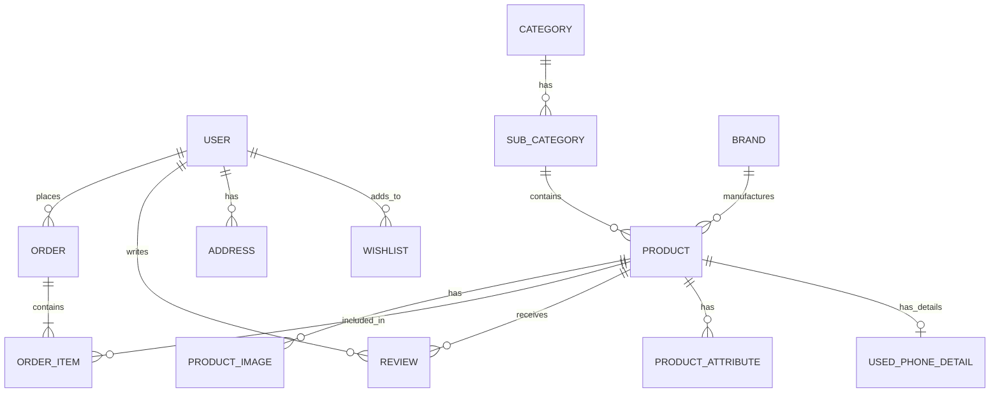

# Mobile Shop Management System - Implementation Plan

This document outlines the architecture, database design, API structure, and development roadmap for the Mobile Shop Management System. Please review this plan, and once approved, we will begin implementation module by module.

## User Review Required

> [!IMPORTANT]
> Please review the **Database Tables** and **Authentication Flow** to ensure they meet your exact business needs. Note that we will be using API Token based authentication with Laravel Sanctum for maximum compatibility and security across mobile and web platforms.

## Open Questions

> [!CAUTION]
> 1. Will the frontend and backend be hosted on the same domain (e.g., `shop.com` and `api.shop.com`)? This affects whether we use Sanctum's cookie-based SPA authentication or standard API tokens.
> 2. Are there any specific local payment gateways (e.g., SSLCommerz, bKash, Nagad) you want integrated for the "Online Payment Ready Structure"?

---

## 1. Complete Project Architecture

The system will use a decoupled, API-driven architecture (Headless approach):

*   **Frontend (Client)**: Next.js (App Router) with TypeScript. It will handle UI/UX, Server-Side Rendering (SSR) for SEO, and state management using Redux Toolkit and TanStack Query. UI components will be built with TailwindCSS and Shadcn UI.
*   **Backend (API Provider)**: Laravel. It will expose secure REST APIs. The codebase will follow SOLID principles, implementing the **Repository Pattern** (for data access) and **Service Layer** (for business logic).
*   **Database**: MySQL, utilizing Eloquent ORM with strict relationships and eager loading for performance.
*   **Authentication**: Laravel Sanctum (Token-based/Cookie-based auth depending on deployment).
*   **Media Handling**: Intervention Image for cropping, resizing, and WebP conversion.

## 2. Folder Structure

We will use a Monorepo style within the provided workspace:

```text
/mobile-shop
├── /frontend                 # Next.js Application
│   ├── /src
│   │   ├── /app              # App Router (Pages, Layouts, API routes if needed)
│   │   ├── /components       # UI Components (atoms, molecules, organisms)
│   │   ├── /hooks            # Custom Hooks (TanStack Query integrations)
│   │   ├── /lib              # Utility functions, Zod schemas, Axios config
│   │   ├── /services         # API endpoint definitions
│   │   ├── /store            # Redux slices and store configuration
│   │   └── /types            # TypeScript definitions (Interfaces/Types)
│   ├── tailwind.config.ts
│   └── package.json
└── /backend                  # Laravel Application
    ├── /app
    │   ├── /Http
    │   │   ├── /Controllers  # API Controllers
    │   │   ├── /Requests     # Form Requests (Validation)
    │   │   └── /Resources    # API Resources (JSON formatting)
    │   ├── /Models           # Eloquent Models
    │   ├── /Repositories     # Data access interfaces and implementations
    │   └── /Services         # Business logic layer
    ├── /database
    │   ├── /migrations
    │   ├── /seeders
    │   └── /factories
    ├── /routes
    │   └── api.php           # REST API Route definitions
    └── composer.json
```

## 3. Database ER Diagram



## 4. All Database Tables

A normalized database structure with proper foreign keys and soft deletes.

1.  **users**: `id`, `name`, `email`, `password`, `phone`, `role` (super_admin, admin, customer), `status`, `timestamps`, `deleted_at`.
2.  **categories**: `id`, `name`, `slug`, `image`, `status`, `meta_title`, `meta_description`, `timestamps`.
3.  **sub_categories**: `id`, `category_id`, `name`, `slug`, `timestamps`.
4.  **brands**: `id`, `name`, `slug`, `logo`, `timestamps`.
5.  **products**: `id`, `type` (new, used, accessory), `name`, `slug`, `sku`, `short_description`, `long_description`, `specifications` (JSON), `category_id`, `sub_category_id`, `brand_id`, `price`, `discount_price`, `stock`, `status`, `is_featured`, `is_trending`, `views`, `meta_title`, `meta_description`, `timestamps`, `deleted_at`.
6.  **used_phone_details**: `id`, `product_id`, `imei`, `battery_health`, `physical_condition`, `accessories_included`, `purchase_date`, `warranty_remaining`, `repair_history`, `timestamps`.
7.  **attributes**: `id`, `name` (e.g., RAM, Storage, Color).
8.  **product_attributes**: `id`, `product_id`, `attribute_id`, `value`, `additional_price`.
9.  **product_images**: `id`, `product_id`, `image_path`, `is_thumbnail`.
10. **orders**: `id`, `user_id`, `order_number`, `total_amount`, `discount_amount`, `coupon_id`, `shipping_address_id`, `billing_address_id`, `payment_method`, `payment_status`, `order_status` (pending, confirmed, processing, shipping, delivered, cancelled, returned, refund), `timestamps`.
11. **order_items**: `id`, `order_id`, `product_id`, `quantity`, `unit_price`, `total_price`.
12. **coupons**: `id`, `code`, `type` (fixed, percent), `value`, `min_spend`, `expires_at`, `status`.
13. **reviews**: `id`, `user_id`, `product_id`, `rating`, `comment`, `status`.
14. **addresses**: `id`, `user_id`, `type` (shipping, billing), `name`, `phone`, `address`, `city`, `zone`, `is_default`.
15. **wishlists**: `id`, `user_id`, `product_id`.
16. **settings**: `id`, `key`, `value` (JSON/Text). Contains site info, SEO defaults, social links.

## 5. API List

All endpoints will be prefixed with `/api/v1`.

**Auth**
*   `POST /auth/register`
*   `POST /auth/login`
*   `POST /auth/logout` (Auth required)
*   `GET /auth/me` (Auth required)

**Public Data (Frontend)**
*   `GET /settings` - Fetch global settings
*   `GET /categories` - Hierarchical list
*   `GET /brands`
*   `GET /products` - With advanced filtering, sorting, pagination
*   `GET /products/{slug}` - Detailed product info
*   `GET /sliders`, `GET /banners`

**Customer (Auth Required)**
*   `GET/POST/PUT/DELETE /profile`
*   `GET/POST/PUT/DELETE /addresses`
*   `GET/POST/DELETE /wishlist`
*   `GET/POST /orders` - Place order & history
*   `GET /orders/{id}` - Track order
*   `POST /reviews`

**Admin (Super Admin/Admin Required)**
*   `GET /admin/dashboard` - Analytics
*   `CRUD /admin/categories`, `/admin/brands`, `/admin/attributes`
*   `CRUD /admin/products`
*   `GET/PUT /admin/orders` - Manage status
*   `GET/PUT /admin/customers`
*   `CRUD /admin/coupons`
*   `GET/PUT /admin/settings`
*   `POST /admin/media` - Upload and compress manager

## 6. Admin Modules

1.  **Dashboard**: Stats, charts, recent orders.
2.  **Catalog**: Products, Categories, Subcategories, Brands, Attributes.
3.  **Sales**: Orders, Invoices, Coupons.
4.  **Customers**: User management, Address books.
5.  **Content**: Sliders, Banners, Pages, Blogs, FAQ.
6.  **Media Manager**: Centralized image upload, compression, WebP conversion.
7.  **Settings & SEO**: Global settings, Meta tags manager, Redirect manager, Roles & Permissions.

## 7. Customer Modules

1.  **Authentication**: Login, Register, Forgot Password.
2.  **Shopping**: Cart, Checkout, Wishlist, Compare.
3.  **Account**: Dashboard, Order History, Tracking, Address Book, Profile.
4.  **Interaction**: Reviews, Ratings.

## 8. Frontend Pages

1.  `/` - Home Page (Hero, Categories, Featured/Trending grids).
2.  `/shop` - Product Listing Page (with Sidebar filters).
3.  `/product/{slug}` - Single Product Details (Images, Specs, Used Phone Details, Reviews).
4.  `/cart` & `/checkout`
5.  `/login` & `/register`
6.  `/dashboard/*` - Customer Portal.
7.  `/blog` & `/blog/{slug}`
8.  `/contact`, `/about-us`, `/faq`

## 9. Backend Structure (Laravel)

*   **Controllers**: Keep them thin. They only validate HTTP requests and return API Resources.
*   **Form Requests**: Strict validation using Laravel's request classes.
*   **Services**: `ProductService`, `OrderService`, `AuthService`. Contains the core business logic (e.g., calculating cart totals, processing image uploads).
*   **Repositories**: `ProductRepositoryInterface`, `EloquentProductRepository`. Abstracts database queries away from controllers and services.
*   **Resources**: `ProductResource`, `OrderResource` to format JSON responses neatly and hide sensitive DB columns.

## 10. Authentication Flow

1.  User submits credentials to Next.js.
2.  Next.js calls Laravel API `/api/v1/auth/login`.
3.  Laravel verifies and issues a Sanctum Token.
4.  Next.js stores the token securely (HTTP-only cookie or secure localStorage).
5.  Subsequent Next.js requests include the `Authorization: Bearer {token}` header.
6.  Axios interceptors in Next.js will handle 401 Unauthorized responses to log the user out seamlessly.

## 11. SEO Strategy

*   **Next.js Metadata API**: Dynamic `<title>` and `<meta>` tags generated server-side for products and categories.
*   **Structured Data (JSON-LD)**: Organization schema on homepage, Product/Review schema on product pages, Breadcrumb schema everywhere.
*   **Image Optimization**: Next.js `<Image>` component for lazy loading and WebP formats.
*   **URLs**: SEO friendly, canonical URLs enforced.
*   **Sitemap**: Dynamic `sitemap.xml` generation and `robots.txt` managed via backend settings.

## 12. Development Roadmap

*   **Phase 1: Foundation (Backend & Frontend Setup)**
    *   Setup Laravel, Next.js, Database Migrations, Models, Repositories, and basic Authentication.
*   **Phase 2: Core Catalog System**
    *   Categories, Brands, Attributes, and the complete Product module (New & Used).
*   **Phase 3: Frontend Shopping Experience**
    *   Home Page, Product Listings, Search & Filters, Product Details.
*   **Phase 4: Cart & Order Management**
    *   Cart logic, Checkout flow, Order placement, Admin order management.
*   **Phase 5: User Profiles & Features**
    *   Customer Dashboard, Wishlist, Reviews, Address Book.
*   **Phase 6: CMS & Settings**
    *   Media Manager, Blogs, Sliders, Global Settings, SEO Meta Manager.
*   **Phase 7: Polish & Optimization**
    *   Performance tuning, caching, final QA, deployment readiness.
